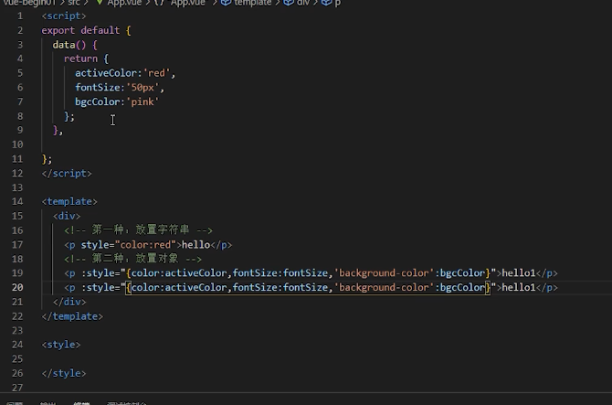

# vue

声明：本笔记截图主要来自：


### 渐进式，可以组件式更改


### 复杂的单页面应用，复杂项目

data 返回数据


与上部关联

mount挂载合上面元素关联

vue文件挂载


vue为根组件


挂载的起点


组件的所有property 无论如何定义都可以在组件的模板中定义


### 声明式渲染，提高开发效率

export default 导出对象

data返回对象


#### property 实例

​                                        

双大括号 数据绑定，除非v-once 一次

### this指向vue实例


### 插入html代码要注意的

上边有标签


v html 如果在评论中可能怕别人写代码插入


### 属性绑定

获取数据，比如图片src 不是定死的地址

 ... </a>

<!-- 简写 -->
<a @click="doSomething"> ... </a>
```

这里的参数是要监听的事件名称：`click`。`v-on` 有一个相应的缩写，即 `@` 字符。我们之后也会讨论关于事件处理的更多细节。

```text

```

### 侦听器与深度侦听器


深度侦听建议侦听对象的属性。


### class与style绑定

当两者样式都在时候只会合并


对象形式


数组使用方式

不好控制class 不建议使用。

数组和对象结合使用。

#### 绑定内联样式style

获取样式有点的方法也有字符串的方法

<div :style="{ color: activeColor, fontSize: fontSize + 'px' }"></div>

全部都是为了灵活操控

驼峰命名方法





### v-if  v-show

if else

else if

#### 条件渲染

包括template都可以设置，但本身它不会显示

v-show 需要完全一样不支持template v-else始终留存与dom中

`v-if` 是“真实的”按条件渲染，因为它确保了在切换时，条件区块内的事件监听器和子组件都会被销毁与重建。

`v-if` 也是**惰性**的：如果在初次渲染时条件值为 false，则不会做任何事。条件区块只有当条件首次变为 true 时才被渲染。

相比之下，`v-show` 简单许多，元素无论初始条件如何，始终会被渲染，只有 CSS `display` 属性会被切换。

总的来说，`v-if` 有更高的切换开销，而 `v-show` 有更高的初始渲染开销。因此，如果需要频繁切换，则使用 `v-show` 较好；


如果在运行时绑定条件很少改变，则 `v-if` 会更合适。

此为面试问题

### v-for

循环渲染列表，需要写详细代表的列表项目

```
	<ul>
		<li v-for="(item, index) in person" :key="index">{{item}}-->{{index}}</li>
	</ul>
```

其中in of可以替换

item 是元素，index是数组下标

### `v-for` 与对象

你也可以使用 `v-for` 来遍历一个对象的所有属性。遍历的顺序会基于对该对象调用 `Object.keys()` 的返回值来决定。

可以用循环数组方式

```
 return {
    myObject: {
      title: 'How to do lists in Vue',
      author: 'Jane Doe',
      publishedAt: '2016-04-10'
    }
  }
}
template
<ul>
  <li v-for="value in myObject">
    {{ value }}
  </li>
</ul>
可以通过提供第二个参数表示属性名 (例如 key)：

template
<li v-for="(value, key) in myObject">
  {{ key }}: {{ value }}
</li>
第三个参数表示位置索引：

template
<li v-for="(value, key, index) in myObject">
  {{ index }}. {{ key }}: {{ value }}
</li>
```

### 通过 key 管理状态[#](https://cn.vuejs.org/guide/essentials/list.html#maintaining-state-with-key)

Vue 默认按照“就地更新”的策略来更新通过 `v-for` 渲染的元素列表。当数据项的顺序改变时，Vue 不会随之移动 DOM 元素的顺序，而是就地更新每个元素，确保它们在原本指定的索引位置上渲染。

默认模式是高效的，但**只适用于列表渲染输出的结果不依赖子组件状态或者临时 DOM 状态 (例如表单输入值) 的情况**。

为了给 Vue 一个提示，以便它可以跟踪每个节点的标识，从而重用和重新排序现有的元素，你需要为每个元素对应的块提供一个唯一的 `key` attribute：

##### 问题methods 一定是：号 

#### deep算法

为了给 Vue 一个提示，以便它可以跟踪每个节点的标识，从而重用和重新排序现有的元素，你需要为每个元素对应的块提供一个唯一的 `key` attribute：


对应下标位置，但是效率过低，

这里使用标识


#### 数组更新监测


